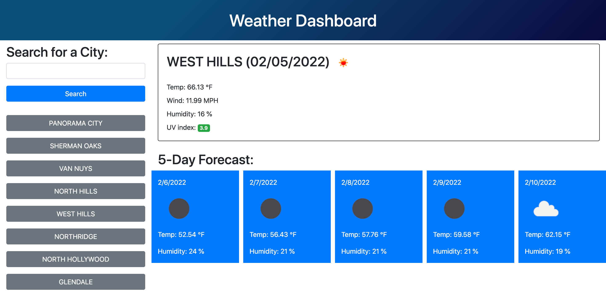

# "Weather-app" project

## Website
https://tokhalyan.github.io/weather-app/ 

## Description 
* This is an interactive website for getting information about weather
* User can search by city name
* User can see last 8 searched city names, push on the city name from the log and get info about that city's weather
* User can get information about temperature, humidity, wind speed, and UV index.
* User can also see weather forecast for next 5 days

## Built with
* HTML
* CSS
* Bootstrap
* JavaScript
* Moment JS

## API used
* openweathermap API

## Instructions 
* User needs to enter a city name
* When user clicks on search button the main content will appear on the right side
* User will see information about current weather and get 5 day forecast
* Whenever user enters city name that will be stored in the local storage
* Data from local storage will be shown under search button as a search log

## Contribution

Made with ❤ by Shahen Tokhalyan

